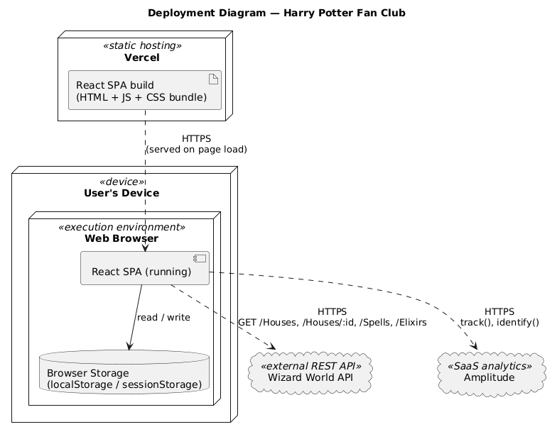

# High Level Diagram

System-level view of the application: actors and external systems, no internal modules. The central point this diagram makes is that **there is no backend of our own**: three systems talk directly to the browser.

## Systems

| System | Role | Do we control it? |
|---|---|---|
| **React SPA** | Renders the UI, owns all business logic, orchestrates the other three systems. The only thing we deploy. | Yes |
| **Wizard World API** | Public, read-only REST API. Source of truth for houses, spells, and elixirs: `GET /Houses`, `GET /Houses/:id`, `GET /Spells`, `GET /Elixirs`. | No, external, no auth |
| **Amplitude** | SaaS product analytics. Receives events (`track()`) and identity calls (`identify()`) directly from the browser. | No, third-party SaaS |
| **Browser Storage** | Client-side persistence (`localStorage`/`sessionStorage`) for the deterministic user profile and session flags. | Yes (client-side) |
| **Vercel** | Static hosting for the SPA build. Deploy target, not a runtime dependency of the app itself. | Yes (hosting only) |

## Why no backend

The Wizard World API is public with no secrets to protect, and Amplitude's Browser SDK is designed to be instrumented client-side (Amplitude's own recommendation for a frontend-only app). Introducing a backend today would add surface area with no functional justification.

**Trade-off worth acknowledging:** a backend/BFF becomes justified the moment we need to hide credentials, cache/transform data, add real user authentication, or unify multiple APIs.

See [low-level.md](low-level.md) for the runtime sequence diagrams.
