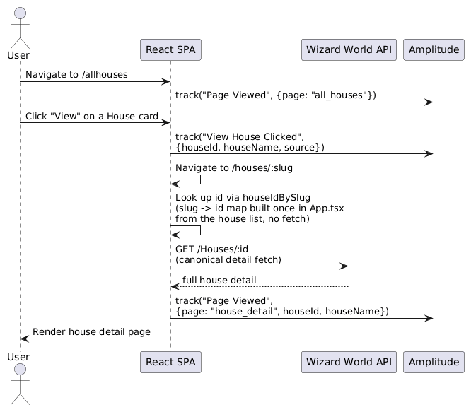
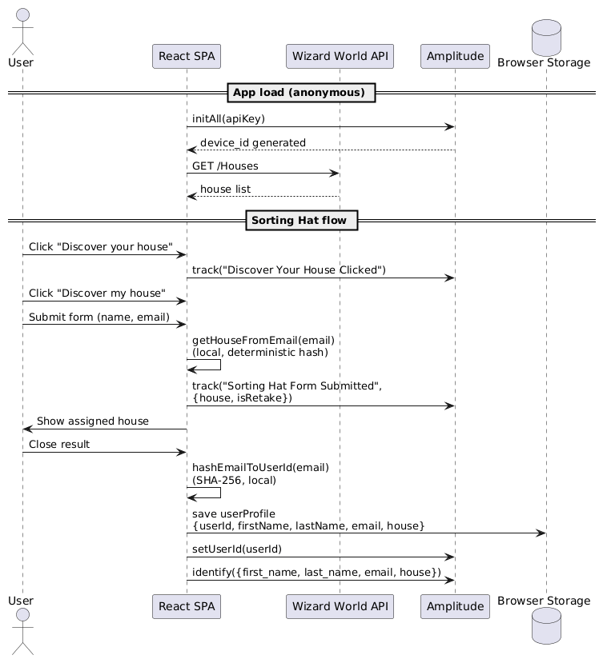
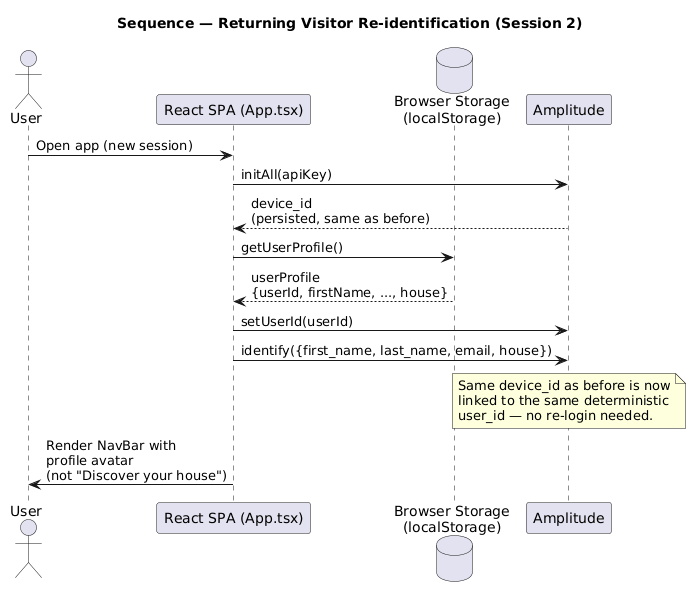
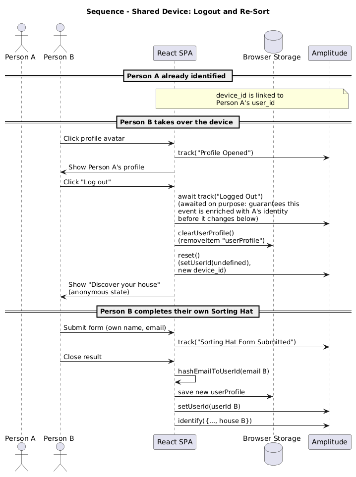
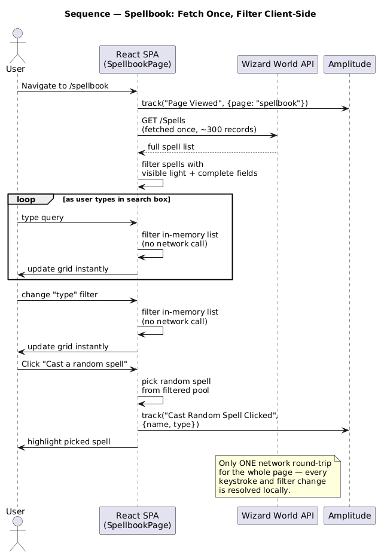

# Low Level Diagram

Runtime behavior of the React SPA, shown as five sequence diagrams, one per key flow. Each one is verified against the current code in `src/`.

## 1. House navigation: list as index, detail as source of truth

The URL uses a readable slug (`/houses/gryffindor`) rather than the API's raw GUID. `App.tsx` builds a lightweight `houseIdBySlug` map (slug → id) from the already-loaded house list and passes that map to `HouseDetailPage`, which looks up the id and fetches the canonical detail fresh from `GET /Houses/:id`. The list acts purely as an index; the detail always reflects the current `/Houses/:id` response.

## 2. Sorting Hat: from anonymous to known user

The house is assigned by a pure, local, deterministic function of the email (no API call). The `userId` sent to Amplitude is a SHA-256 hash of the normalized email, so the same email always resolves to the same Amplitude user, regardless of device.

Closing the result screen creates the profile and calls `identifyUser()`, which sets the `userId` on the browser's current `device_id`. Amplitude links that `device_id` to the new user, merging this session's own prior anonymous events (`Discover Your House Clicked`, `Sorting Hat Form Submitted`) into the resulting profile.

## 3. Returning visitor: automatic re-identification

Since the profile persists in `localStorage`, `App.tsx` calls `identifyUser()` again on mount whenever it finds a saved profile, continuing the same `device_id`/`user_id` pairing from the previous session.

## 4. Shared device: logout and re-sort

Logging out fires `trackEvent("Logged Out")` and awaits it to completion, then clears the `userId` with `amplitude.setUserId(undefined)`. The `device_id` itself is never rotated by this app; whoever identifies next on that device does so under their own `userId`, and Amplitude's own identity resolution decides how to associate that device's history.

## 5. Spellbook: fetch once, filter client-side

`/Spells` returns a bounded dataset (~300 records) fetched once; every keystroke in the search box and every type-filter change is resolved against the in-memory list, with zero additional network round-trips.

---

See [high-level.md](high-level.md) for the system-level view.
